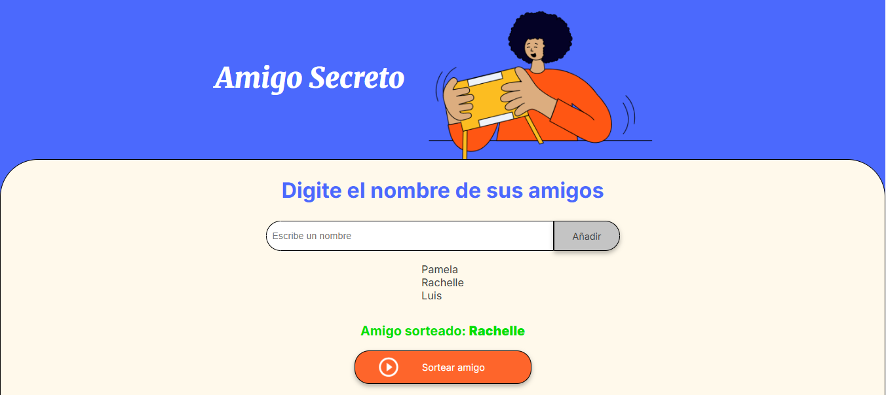

# Aplicación Amigo Secreto

Esta aplicación permite a los usuarios gestionar una lista de amigos y seleccionar aleatoriamente uno como "amigo secreto". Es ideal para organizar intercambios de regalos o actividades similares.

## Características

- **Agregar amigos:** Los usuarios pueden añadir amigos a una lista ingresando sus nombres.
- **Prevención de duplicados:** La app evita que se agreguen nombres repetidos.
- **Validación de entrada:** No permite agregar nombres vacíos.
- **Mostrar lista de amigos:** La lista actual de amigos se muestra de forma dinámica.
- **Selección aleatoria:** Permite seleccionar un amigo al azar de la lista.
- **Mensajes al usuario:** Muestra alertas para acciones no válidas (por ejemplo, nombre vacío, duplicado o intentar sortear sin amigos).

## Uso

1. **Agregar un amigo**
   - Escribe el nombre de un amigo en el campo de entrada.
   - Haz clic en el botón "Agregar".
   - El nombre aparecerá en la lista de abajo.

2. **Sortear un amigo**
   - Haz clic en el botón "Sortear".
   - La aplicación mostrará el nombre del amigo seleccionado al azar.

## Documentación del código

### Variables

- `Amigos`: Array que almacena los nombres de los amigos.

### Funciones

- `agregarAmigo()`
  - Obtiene el valor del campo de entrada.
  - Valida que el nombre no esté vacío ni duplicado.
  - Agrega el nombre al array `Amigos`.
  - Limpia el campo de entrada.
  - Llama a `actualizarLista()` para mostrar la lista actualizada.

- `actualizarLista()`
  - Limpia la lista actual en el HTML.
  - Recorre el array `Amigos` y muestra cada nombre como un elemento de lista.

- `sortearAmigo()`
  - Verifica si hay amigos en la lista.
  - Selecciona un amigo al azar del array `Amigos`.
  - Muestra el nombre del amigo sorteado en el HTML.
